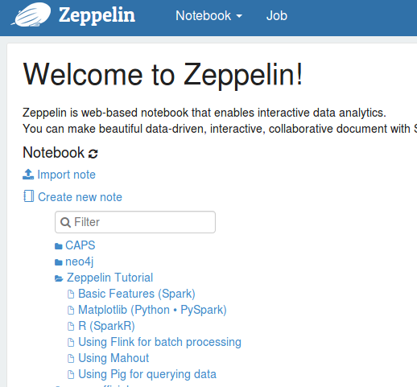
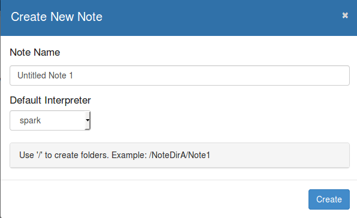
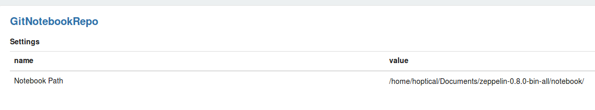

# Apache Zeppelin Exploration

## Introduction

Apache Zeppelin is a great notebook like Jupyter notebook, But this one has great features with concentrating on big data platforms as below:

- Supporting a lots of interpreters
- Awesome visualizing tools like table, scatter, plots and <u>graphs</u>


## Installation

Download the latest release from https://zeppelin.apache.org/download.html

Extract it and change directory to the extracted folder

Then for Start:

```shell
bin/zeppelin-daemon.sh start
```

For Stop

```shell
bin/zeppelin-daemon.sh stop
```

and for Restart

```shell
bin/zeppelin-daemon.sh restart
```


After starting, browse `localhost:8080` to work with apache zeppelin UI.

You may create your own note or take a tour at zeppelin great tutorials




## Quick Start

After creating a note, You should choose the path and your default interpreter:




> Note: You can bind or unbind your desirable interpreters. To do this, click on the gear icon, top right of the notebook and change the bind option.

> Note: First interpreter is the default one. If you want to change interpreter in the cell of notebook, use `%` qualifier. for example:
>
> ```
> %sql
> %neo4j
> ```


## Where are the notebook files?

Contrary to what we have seen in Jupyter notebook, that you can save every note to your desirable path, in Zeppelin, you should choose a path for all of the notes and they are save there. This path is configurable in notebook repository option:



## Case Study

In this section, we are going to explore CAPS(Cypher for Apache Spark) library in Apache Zeppelin notebook. CAPS extends [Apache Spark™](https://spark.apache.org) with [Cypher](https://neo4j.com/docs/developer-manual/current/cypher/), the industry's most widely used [property graph](https://github.com/opencypher/openCypher/blob/master/docs/property-graph-model.adoc) query language defined and maintained by the [openCypher](http://www.opencypher.org) project.
It allows for the **integration** of many **data sources** and supports **multiple graph** querying.
It enables you to use your Spark cluster to run **analytical graph queries**.
Queries can also return graphs to create **processing pipelines**.

Because CAPS is working on apache spark, make CAPS on a notebook with Spark as default interpreter.

### CAPS installation

#### 1. Install in Apache Zeppelin

To install CAPS on apache zeppelin, follow these steps:

1. Clone the latest release of CAPS and extract it.

2. Change directory to extracted folder and run this commands:

   If maven is not installed:

   ```shell
   sudo apt update
   sudo apt install maven
   ```

   after installing maven:

   ```shell
   mvn clean install
   ```

3. In the top of your notebook, write this command:

   ```
   %spark.dep
   z.load("org.opencypher:spark-cypher:0.2.0")
   ```

   > Note: 
   >
   > These values are injected automatically in apache zeppelin:
   >
   > - z is the the apache zeppelin context
   > - spark is the spark session 
   > - sc is the spark context

This instruction is due to [this link](https://github.com/opencypher/cypher-for-apache-spark/wiki/Use-CAPS-in-a-Zeppelin-notebook)

#### 2. Install in sbt(for intellij IDEA or production solution)

To install on sbt, add this command to build.sbt:

```
libraryDependencies += "org.opencypher" % "spark-cypher" % "0.1.6"
```

Remember to add `fork in run := true` in your `build.sbt` for scala projects; this is not CAPS specific, but a quirk of spark execution that will help [prevent problems](https://stackoverflow.com/questions/44298847/why-do-we-need-to-add-fork-in-run-true-when-running-spark-sbt-application)

A sbt file with spark and CAPS dependency support could be like this:

```scala
name := "CAPS"

version := "0.1"

scalaVersion := "2.11.8"

resolvers += "Spark Packages Repo" at "http://dl.bintray.com/spark-packages/maven"
fork in run := true
libraryDependencies ++= {
  val sparkVer = "2.3.1"
  Seq(
    "org.apache.spark" %% "spark-core" % sparkVer % "compile" withSources(),
    "org.apache.spark" %% "spark-sql" % sparkVer % "compile" withSources(),
    //"org.apache.spark" %% "spark-graphx" % sparkVer % "compile" withSources(),
    //"graphframes" % "graphframes" % "0.6.0-spark2.3-s_2.11",
    "org.opencypher" % "spark-cypher" % "0.2.0"
  )
}
```

### Install Neo4j schema procedure

To be able to connect to neo4j database, neo4j schema procedure provided by CAPS should be installed. This procedure installation is in [here](https://github.com/opencypher/cypher-for-apache-spark/wiki/Neo4j-Schema-Procedure)

### CAPS Notebook

The CAPS example is in the notebook with proper comment and documentation. Please import and enjoy it!

